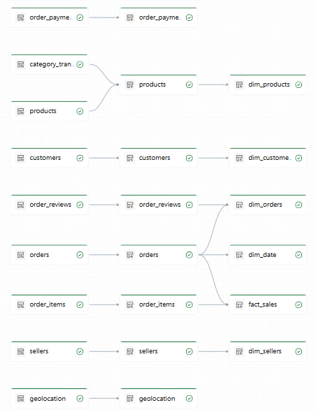
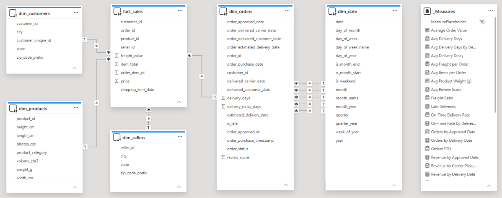
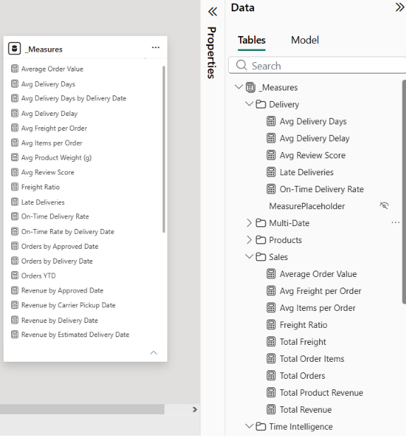

# Olist E-Commerce Analytics Pipeline

An end-to-end medallion data pipeline (Bronze → Silver → Gold) built on **Databricks Lakeflow Spark Declarative Pipelines** with a star-schema gold layer powering a **Power BI semantic model**.

The PySpark equivalent ([olist_medallion_pyspark.py](olist_medallion_pyspark.py)) mirrors every transformation in the SQL pipeline, enabling the same logic to run outside the DLT environment. A companion Databricks AI/BI Dashboard exists in the workspace for cross-checking Power BI figures during development but is not part of this repository.

---

## Table of Contents

1. [Architecture](#architecture)
2. [Repository Structure](#repository-structure)
3. [Pipeline Layers](#pipeline-layers)
4. [Power BI Semantic Model](#power-bi-semantic-model)
5. [Key Insights & Recommendations](#key-insights--recommendations)
6. [Getting Started](#getting-started)
7. [Validation](#validation)

---

## Architecture

```
┌─────────────┐     ┌─────────────┐     ┌──────────────┐     ┌──────────────┐
│   Raw CSV    │────▶│   Bronze    │────▶│   Silver      │────▶│   Gold       │
│  (Volumes)  │     │  Streaming  │     │  Cleaned     │     │  Star Schema │
│  9 sources  │     │  9 tables   │     │  8 tables    │     │  6 tables    │
└─────────────┘     └─────────────┘     └──────────────┘     └──────┬───────┘
                                                                        │
                                              ▼
                                     ┌──────────────┐
                                     │  Power BI    │
                                     │  Semantic    │
                                     │  Model       │
                                     └──────────────┘
```

**Source**: [Brazilian E-Commerce Public Dataset by Olist](https://www.kaggle.com/datasets/olistbr/brazilian-ecommerce) (Kaggle) — 9 CSV files covering 100K orders from 2016–2018.

---

## Screenshots

### Databricks Lakeflow Pipeline (DLT)



*Screenshot: DLT pipeline graph showing all 9 Bronze → 8 Silver → 6 Gold tables with completion status.*

### Power BI Semantic Model — Star Schema



*Screenshot: Power BI Model View showing fact_sales at center with dimension tables and relationship lines.*

### DAX Measure Organization



*Screenshot: Power BI Fields pane showing the _Measures table with organized display folders.*

---

## Repository Structure

```
olist_medallion_pipeline_e5ea8eda/
├── transformations/
│   ├── 01_bronze.sql          # DLT: 9 streaming tables (raw CSV ingestion)
│   ├── 02_silver.sql          # DLT: 8 materialized views (cleaned, validated)
│   └── 03_gold.sql           # DLT: 6 materialized views (star schema)
├── explorations/
│   └── gold_aggregations.sql  # 31 PBI DAX measure equivalents (SQL)
├── docs/
│   └── img/                   # Screenshots for README
│       ├── dlt_pipeline_graph.png
│       ├── pbi_star_schema.png
│       ├── pbi_measures_folders.png
│       └── pbi_measure_summary.png
├── olist_medallion_pyspark.py # PySpark equivalent of the entire pipeline
└── README.md                  # This file
```

---

## Pipeline Layers

### Bronze Layer — Raw Ingestion (`01_bronze.sql`)

| Table | Source CSV | Description |
|-------|-----------|-------------|
| `customers` | customers.csv | Customer IDs and locations |
| `orders` | orders.csv | Order status and timestamps |
| `order_items` | order_items.csv | Product, seller, price, freight |
| `order_payments` | order_payments.csv | Payment type, installments, value |
| `order_reviews` | order_reviews.csv | Review scores 1–5 |
| `products` | products.csv | Product attributes and dimensions |
| `sellers` | sellers.csv | Seller IDs and locations |
| `geolocation` | geolocation.csv | ZIP-to-lat/lng mapping |
| `category_translation` | category_translation.csv | Portuguese→English category names |

Each table adds `_ingested_at` and `_source_file` metadata columns.

### Silver Layer — Cleaned & Validated (`02_silver.sql`)

| Table | Key Transformations | Data Quality Constraints |
|-------|---------------------|------------------------|
| `customers` | trim, lpad zip, initcap city, upper state | `customer_id` NOT NULL, state = 2 chars |
| `orders` | dedup by order_id, derive `delivery_days`, `delivery_delay_days`, `is_late` | purchase timestamp present, delivery after purchase |
| `order_items` | dedup by order_id+item_id, compute `item_total = price + freight` | price/freight ≥ 0, IDs NOT NULL |
| `order_payments` | dedup by order_id+sequential | known payment types only, value ≥ 0 |
| `order_reviews` | dedup by order_id (latest review) | score 1–5, IDs NOT NULL |
| `products` | join category translation, compute `volume_cm3` | category ≠ 'unknown' |
| `sellers` | trim, lpad zip, initcap city | state = 2 chars |
| `geolocation` | aggregate by ZIP prefix (avg coordinates) | — |

### Gold Layer — Star Schema (`03_gold.sql`)

```
         ┌──────────────┐
         │  dim_customers│
         └──────┬───────┘
                │
  ┌──────────┐  │  ┌────────────┐
  │fact_sales │──┼──│  dim_orders  │──┬─── dim_date
  └────┬─────┘  │  └────────────┘  │
       │        │                   │
  ┌────▼─────┐  │              ┌───▼──────┐
  │dim_products│ │              │(reviews) │
  └──────────┘  │              └──────────┘
         ┌──────▼───────┐
         │  dim_sellers  │
         └──────────────┘
```

| Table | Grain | Key Columns |
|-------|-------|-------------|
| `dim_customers` | 1 row per customer_id | customer_id, city, state |
| `dim_products` | 1 row per product_id | product_id, product_category (English), weight_g, volume_cm3 |
| `dim_sellers` | 1 row per seller_id | seller_id, city, state |
| `dim_orders` | 1 row per order_id | order_id, 5 date columns, delivery_days, is_late, review_score |
| `fact_sales` | 1 row per order item | order_id, product_id, seller_id, price, freight_value, item_total |
| `dim_date` | 1 row per day | date, year, quarter, month, month_name, is_weekend, is_month_start/end |

---

## Power BI Semantic Model

The gold layer maps directly to a Power BI star schema with:

- **Active relationship**: `dim_date[date] → dim_orders[order_purchase_date]`
- **Inactive relationships** (activated via `USERELATIONSHIP`):
  - `dim_date[date] → dim_orders[order_approved_date]`
  - `dim_date[date] → dim_orders[delivered_carrier_date]`
  - `dim_date[date] → dim_orders[delivered_customer_date]`
  - `dim_date[date] → dim_orders[estimated_delivery_date]`

### 31 DAX Measures (organized into 4 display folders)

| Folder | Measures |
|--------|----------|
| **Sales** | Total Revenue, Total Product Revenue, Total Freight, Total Order Items, Total Orders, Average Order Value, Avg Items per Order, Avg Freight per Order, Freight Ratio |
| **Delivery** | Avg Review Score, Late Deliveries, On-Time Delivery Rate, Avg Delivery Days, Avg Delivery Delay |
| **Products** | Total Products Sold, Avg Product Weight |
| **Time Intelligence** | Revenue YTD, Revenue Prev Month, Revenue MoM %, Revenue Prev Year (SPLY), Revenue YoY %, Orders YTD, Orders Prev Month, Orders MoM %, Orders Prev Year, Orders YoY % |
| **Multi-Date** | Revenue by Approved/Carrier/Delivery/Estimated Date, Orders by Delivery/Approved Date, Revenue YTD by Delivery Date, Revenue YoY% by Delivery Date, Avg Delivery Days by Delivery Date, On-Time Rate by Delivery Date |

All 31 measures have SQL equivalents in [`explorations/gold_aggregations.sql`](explorations/gold_aggregations.sql) for validation.


---

## Key Insights & Recommendations

### 1. Revenue Concentration

> **Insight**: Revenue is concentrated in a small number of product categories. The top 5 categories (bedding, furniture, health & beauty, sports, computers) account for a disproportionate share of total revenue.
>
> **Recommendation**: Focus marketing spend and inventory investment on these high-revenue categories. Consider bundling complementary products (e.g., bed sheets + pillows) to increase average order value.

### 2. Delivery Performance

> **Insight**: A significant percentage of orders arrive late (`is_late = TRUE`), negatively correlated with review scores. Orders with delivery delays consistently receive 1–2 star reviews.
>
> **Recommendation**: Set tighter estimated delivery dates (currently over-promised). Implement real-time tracking notifications to set customer expectations. Prioritize fulfillment for sellers with historically late deliveries.

### 3. Review Score Distribution

> **Insight**: The review distribution is heavily polarized — mostly 5-star or 1-star, with few middle scores. 1-star reviews are almost entirely driven by late deliveries, not product quality.
>
> **Recommendation**: Since fixing delivery reliability would convert many 1-star reviews to 4–5 star, prioritize logistics improvements over product quality investments. Target a 90%+ on-time delivery rate.

### 4. Seasonality & Growth

> **Insight**: Revenue shows clear seasonality with peaks in November (Black Friday) and March. Year-over-year revenue is growing, but month-over-month volatility is high.
>
> **Recommendation**: Build seasonal demand forecasts to optimize inventory levels. Staff up fulfillment and customer service teams ahead of November and March peaks. Use MoM% trends to detect demand shifts early.

### 5. Payment Behavior

> **Insight**: Credit cards dominate payment mix (~75% of orders). Boleto (cash-based) and vouchers serve distinct customer segments.
>
> **Recommendation**: Offer installment promotions during peak seasons to drive higher AOV. Explore voucher programs for customer acquisition in price-sensitive segments.

### 6. Seller Performance

> **Insight**: Revenue is highly concentrated among top sellers — the top 10 sellers account for a large share of GMV. Many sellers have only a few orders.
>
> **Recommendation**: Implement a seller scorecard combining revenue, on-time delivery rate, and review score. Offer logistics support to mid-tier sellers with high potential. Consider a seller consolidation program for underperformers.

### 7. Geographic Opportunities

> **Insight**: Revenue is concentrated in São Paulo (SP) and Rio de Janeiro (RJ), but customer acquisition cost is rising in saturated markets. Northeastern states show growth potential with lower penetration.
>
> **Recommendation**: Target marketing campaigns at underpenetrated states (Northeast region). Optimize last-mile delivery in high-density urban areas to reduce delivery time.

### 8. Freight Ratio

> **Insight**: Freight as a percentage of total order value (`freight_ratio`) is significant, especially for low-ticket items. This erodes margins on small orders.
>
> **Recommendation**: Set a minimum order threshold for free shipping. Negotiate bulk shipping rates with logistics partners. Consider a freight subsidy for first-time buyers to improve conversion.

---

## Getting Started

### Option A: Databricks Lakeflow Pipeline (SQL)

1. Upload raw CSVs to `/Volumes/olist/bronze/raw_files/<table_name>/`
2. Create a DLT pipeline pointing to `transformations/` glob
3. Run the pipeline — Bronze → Silver → Gold auto-materializes
4. Validate with queries in `explorations/gold_aggregations.sql`

### Option B: PySpark (standalone or notebook)

1. Ensure raw CSVs are accessible at the configured `RAW_PATH`
2. Run [`olist_medallion_pyspark.py`](olist_medallion_pyspark.py) in a Databricks notebook or any PySpark environment with Unity Catalog access
3. All 9 bronze + 8 silver + 6 gold tables are created with `saveAsTable`
4. All 31 aggregation measures print results for verification

### Prerequisites

- Databricks workspace with Unity Catalog (catalog: `olist`)
- Schemas: `olist.bronze`, `olist.silver`, `olist.gold`
- SQL Warehouse or Serverless compute
- Raw CSV data in UC Volume `/Volumes/olist/bronze/raw_files/`

---

## Validation

The `gold_aggregations.sql` file provides SQL equivalents for all 31 Power BI DAX measures. Run any section to compare:

```sql
-- Example: validate Total Revenue
SELECT SUM(item_total) AS total_revenue FROM olist.gold.fact_sales;
```

Cross-check the SQL output against the Power BI card visuals. If they match, the semantic model is correctly wired. The PySpark file produces the same metrics via DataFrame operations.

---

## Tech Stack

| Component | Technology |
|-----------|-----------|
| Orchestration | Databricks Lakeflow Spark Declarative Pipelines (DLT) |
| Storage | Unity Catalog + Delta Lake (medallion: Bronze/Silver/Gold) |
| Processing | Apache Spark / PySpark (Photon-enabled) |
| BI — Desktop | Power BI with star schema semantic model (31 DAX measures) |
| Version Control | GitHub (SQL + PySpark + README) |

---

## Author

**ddisrael1@alum.up.edu.ph**
September 2026
